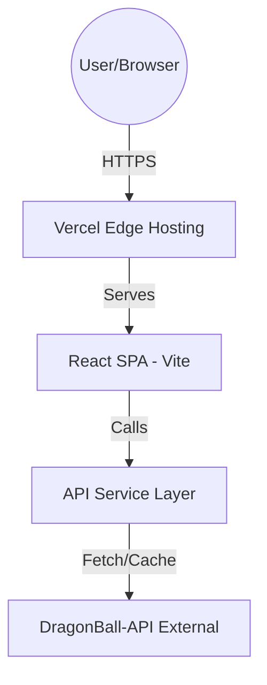

# DragonDex Fullstack Architecture

## 1. Introduction
This document outlines the architecture for **DragonDex**, a responsive DBZ-themed character explorer. The design focuses on high performance, visual immersion ("Radar do Dragão"), and a clean separation between the UI and data fetching layers.

### Starter Template
**N/A - Greenfield project**. Initialized with Vite + React + Tailwind CSS.

### Change Log
| Date | Version | Description | Author |
|------|---------|-------------|--------|
| 2026-02-12 | 1.0.0 | Initial Architecture Design | Aria (Architect) |

---

## 2. High Level Architecture

### Technical Summary
DragonDex is built as a **Single Page Application (SPA)** using React and Vite. It leverages a **Service-Oriented Frontend Architecture**, where all business logic and API interactions are encapsulated in a dedicated services layer. This approach ensures the UI remains purely presentational while allowing for easy caching and error handling. Deployment is handled via **Vercel** for optimal global performance.

### Platform & Infrastructure
- **Platform**: Vercel (Frontend Hosting & Edge Network).
- **Key Services**:
  - **Vercel Edge Caching**: For optimizing character data and images.
  - **GitHub Actions**: For automated testing and PR previews.
- **Regions**: Global (Vercel Edge).

### Repository Structure
- **Structure**: Single Repository (Monolith-style frontend).
- **Package Strategy**: Standard Vite structure optimized for clarity.
  - `/src/components`: Presentational and container components.
  - `/src/services`: API client and data normalization.
  - `/src/hooks`: Custom hooks for state and lifecycle management.
  - `/src/styles`: Tailwind configuration and theme tokens.

### High Level Architecture Diagram


---

## 3. Tech Stack

| Category | Technology | Version | Purpose | Rationale |
|----------|------------|---------|---------|-----------|
| Frontend | React | ^18.x | UI Framework | Standard, efficient, large ecosystem. |
| Build Tool | Vite | ^5.x | Development/Build | Extremely fast HMR and optimized builds. |
| CSS | Tailwind CSS | ^3.x | Styling | Utility-first, perfect for theme tokens. |
| Icons | Lucide React | Latest | UI Icons | Clean, consistent SVG icons. |
| Fetching | Axios / Fetch API | Native | API Calls | Simple and effective for REST. |
| Animations | Framer Motion | ^11.x | Immersive Effects | Powering "Radar Sweep" and "Aura Mode". |

---

## 4. Data Models

### Warrior (Character)
**Purpose**: Represents a DBZ character with stats and metadata.

**TypeScript Interface**:
```typescript
interface Warrior {
  id: number;
  name: string;
  ki: string;
  maxKi: string;
  race: string;
  gender: string;
  description: string;
  image: string;
  affiliation: string;
  planet: Planet;
  transformations: Transformation[];
}

interface Planet {
  id: number;
  name: string;
  isDestroyed: boolean;
  description: string;
  image: string;
}

interface Transformation {
  id: number;
  name: string;
  image: string;
  ki: string;
}
```

---

## 5. Frontend Architecture

### Component Organization
```text
src/
├── components/
│   ├── ui/             # Atomic components (Buttons, Cards, Scouter Stats)
│   ├── radar/          # Radar-specific components (Sweep Effect, Sonar Grid)
│   ├── layout/         # Header, Footer, Hero
│   └── views/          # Pages (Home, CharacterDetail)
├── services/
│   ├── api.ts          # Axios instance & config
│   └── warriorService.ts # Character fetching logic
├── hooks/
│   ├── useWarriors.ts  # Fetching and filtering characters
│   └── useRadar.ts     # Animation and sound state for radar
└── styles/
    ├── theme.css       # Tailwind @layer tokens
    └── animations.css  # Custom CSS keyframes for Auras
```

### Component Template (Example: ScouterStat)
```typescript
import React from 'react';

interface ScouterStatProps {
  label: string;
  value: string;
  color?: 'green' | 'red';
}

export const ScouterStat: React.FC<ScouterStatProps> = ({ label, value, color = 'green' }) => {
  return (
    <div className={`flex flex-col border-l-2 pl-2 border-${color}-500`}>
      <span className="text-xs uppercase opacity-70">{label}</span>
      <span className="text-xl font-mono tracking-tighter">{value}</span>
    </div>
  );
};
```

---

## 6. Theme Tokens (Tailwind)

| Token | Value | Concept |
|-------|-------|---------|
| `dbz-orange` | `#FF9900` | GI/Goku Main |
| `dbz-blue` | `#003366` | Vegeta/Armor |
| `dbz-gold` | `#FFCC00` | SSJ Aura |
| `radar-green` | `#00FF41` | Sonar/Active |

---

## 7. Next Steps
1. **Dev Prompt**: Initiate `@dev` to bootstrap the project with the defined structure.
2. **Review**: User to confirm architecture.
